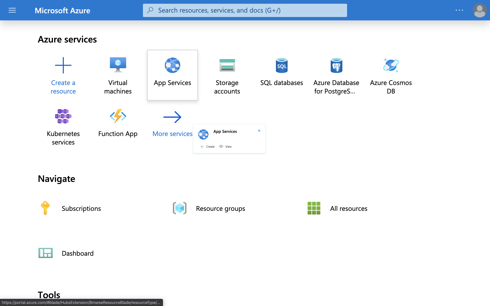
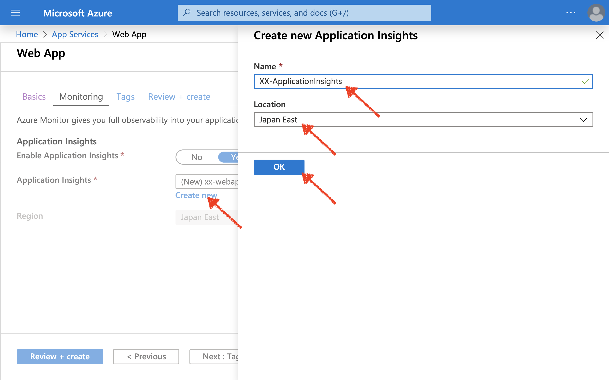
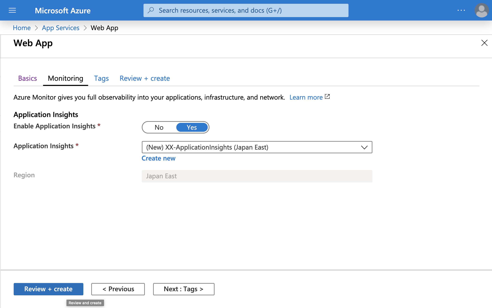
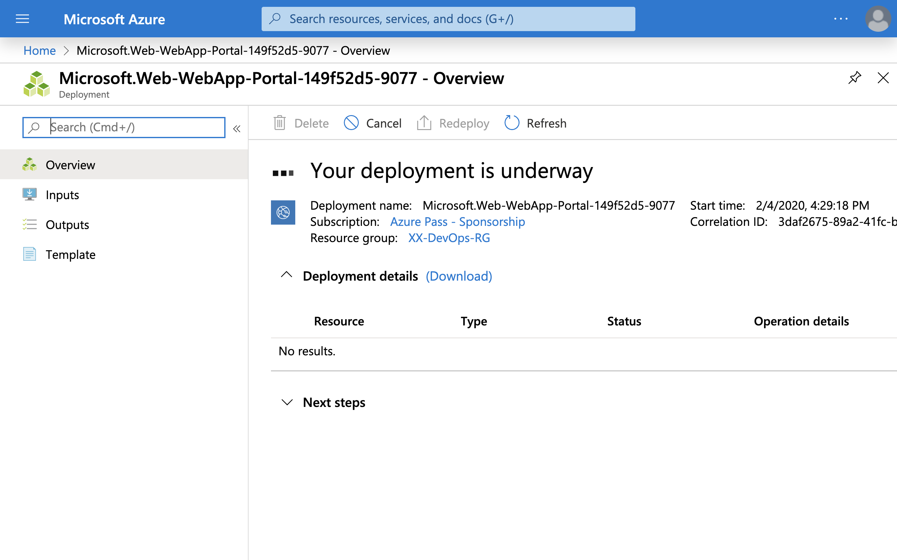

# Microsoft Azure DevOps Handson
Updated: 2020/02/04

---
このハンズオンでは、Azure DevOps と Azure Web App を使い、Microsoft が提供している DevOps プロセスを一貫して体験いただきます。

## 目次

1. 準備
1. Azure Web App を Azure にプロビジョン
1. Azure DevOps のプロジェクトを作成
1. Azure Pipelines にビルドパイプラインを作成
1. Azure Pipelines にリリースパイプラインを追加
1. Azure Pipelines 経由で App Service の運用環境にアプリケーションをデプロイ
1. Azure Pipelines のリリースパイプラインに Staging 環境へのデプロイプロセスを追加
1. Azure Web App に Staging スロットを追加
1. Azure Repository からコードを変更し、コミットをトリガーに CI/CD が走り出すことを確認
1. Azure Web App の機能をためす。
 

----
## 1. 準備

#### 用意するもの
- Azure Subscription
- Visual Studio Code (Optional)

#### ハンズオンで使用するページ
- 当ハンズオン資料
https://github.com/yuhattor/DevOpsHandson
- Azure Portal
https://portal.azure.com
- Azure DevOps
https://dev.azure.com/

## 2. Azure DevOps にパイプラインを構築

#### Azure DevOps に Organization を作成します。 (既にある場合はスキップ可能です。)

1. Azure DevOps のページにログインします (https://dev.azure.com)

