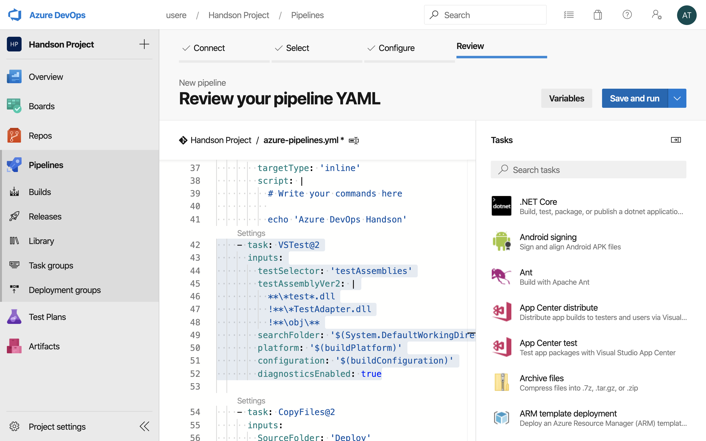
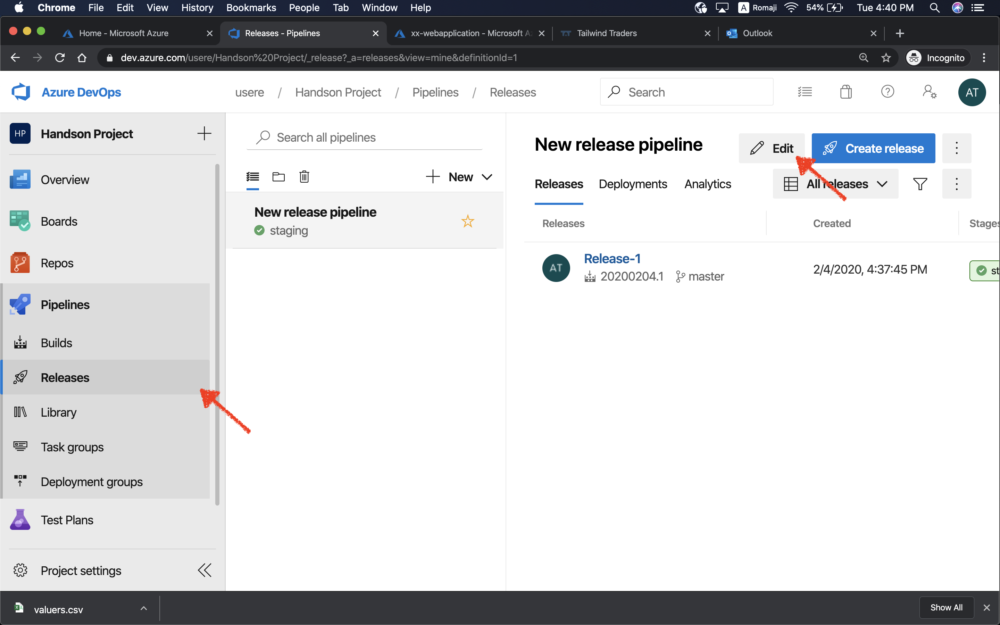
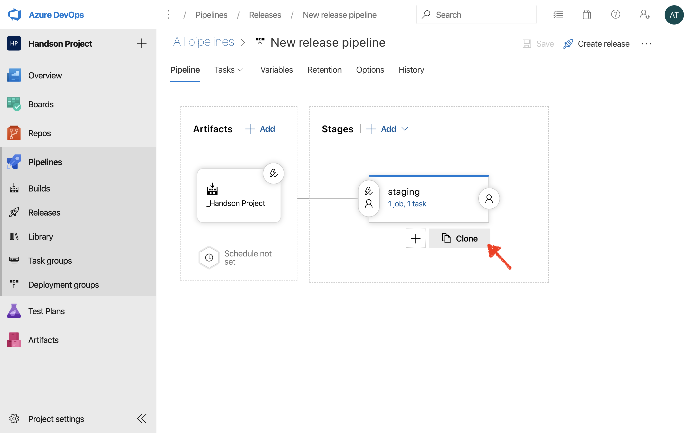
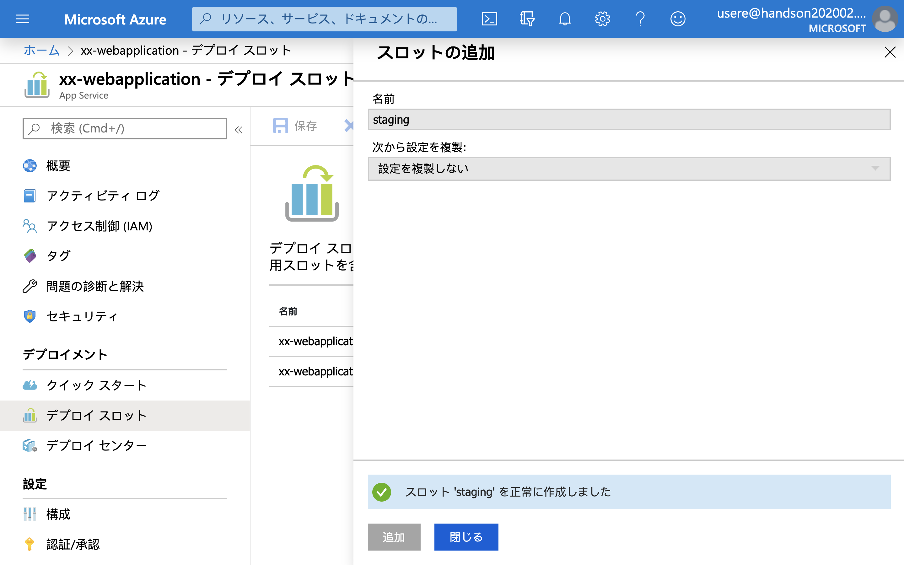
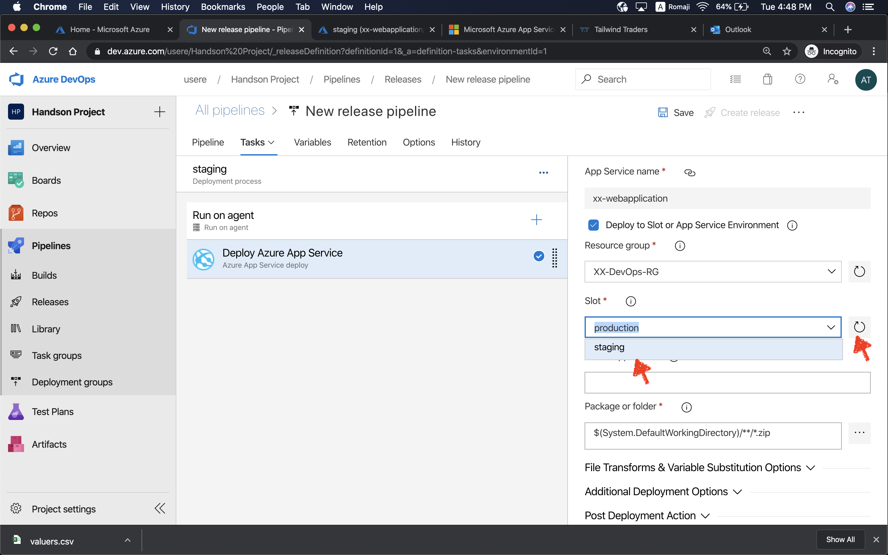

# Microsoft Azure DevOps Handson
Updated: 2020/02/04

---
このハンズオンでは、Azure DevOps と Azure Web App を使い、Microsoft が提供している DevOps プロセスを一貫して体験いただきます。

## 目次

1. 準備
2. Azure Web App を Azure にプロビジョ二ング
3. Azure DevOps のプロジェクトを作成
4. Azure Pipelines にビルドパイプラインを作成
5. Azure Pipelines にリリースパイプラインを追加し、基本的な CI/CD を実現する
6. Azure Pipelines のリリースパイプラインに Staging 環境へのデプロイプロセスを追加
7. Azure Repository からコードを変更し、コミットをトリガーに CI/CD が走り出すことを確認
8. Azure Web App の機能で遊ぶ

## 概要
# TBD

---

## 1. 準備

#### 用意するもの
- Azure Subscription

#### ハンズオンで使用するページ
- 当ハンズオン資料
https://github.com/yuhattor/DevOpsHandson
- Azure Portal
https://portal.azure.com
- Azure DevOps
https://dev.azure.com/

---

## 2. Azure Web App を Azure にプロビジョ二ング

### 手順

1. Azure Portal (https://portal.azure.com) にアクセスします。

1. ホームページに App Service があるので、作成していきます。

1. 追加/Add ボタンから 新しい App Service を追加します。

1. リソースグループを追加します。リソースグループの名前は任意の名前で良いですが、同一サブスクリプションの中でかぶらないようにします。当ハンズオン では、例として XX の値を置いておりますが、XX はご自身の ID や ニックネームなどで置き換えてください。

1. Web App の名前を定義します。また、デプロイモデルは コード/Code を選びます。Web App における最も簡単なデプロイ方法の一つで、.NET や Java など、様々な言語・フレームワークのアプリケーションをそのまま配置することができます。今回のハンズオンでは OS は Windows を選びましょう。

1. App Service Plan を作成します。この App Service Plan とは、 Web App など、App Service にデプロイされるインスタンスの課金単位になります。

1. App Service Plan の値を入力したら、モニタリングの設定に移ります。

1. Application Insights をデプロイするための設定に移ります。
Application Insights とは開発者や DevOps プロフェッショナル向けの拡張可能なアプリケーション パフォーマンス管理 (APM) サービスです。
初期設定で 値が入っていますが、任意の名前と場所を決定したら OK で確定します。入力する値は以上ですので、この後は入力内容の確認に移ります。

1. 表示された内容で間違いがない場合、Web App をデプロイします。

1. 数十秒待つと Web App がデプロイされますので、デプロイされたリリースを確認しにいきます。

1. Web App の画面に到達したらホーム画面にある URL をクリックして、デプロイされたものを確認します。

1. Web App の初期画面 が表示されたことを確認します。

### この章で作ったもの
# TBD

### 備考/参考URL
- App Service / Web App とは？
  https://azure.microsoft.com/ja-jp/services/app-service/web/

- Resource Group とは
  https://tech-blog.cloud-config.jp/2019-06-06-evening-azure-challenge-002/

- App Service と App Service Plan の違いって？
  https://www.cloudou.net/app-service/app001/

- Application Insights とは？
  https://docs.microsoft.com/ja-jp/azure/azure-monitor/app/app-insights-overview

---

## 3. Azure DevOps のプロジェクトを作成

1. Azure DevOps のページにログインします (https://dev.azure.com)

1. 初回ログインの際には名前を入力する必要があります。

1. Continue で初回登録を完了します。すると、初期 Organization が設定されます。

1. プロジェクトを作成する画面に映りますので、最初のプロジェクトを作成しましょう。プロジェクト名は任意です。
プロジェクトは Private か Public を選ぶことができます。

1. プロジェクトができたらクリックしてプロジェクトページにアクセスします。

**既存の組織がある場合**
1. もし既存の組織がある、また以前に Azure DevOps を使っていた場合は、ログイン後そのまま該当の組織において新しいプロジェクトを作ります。
また、新しく組織を作る場合は New Organization から新しい組織を作ります。

1. Continue で先に進み必要事項を記入します。

1. 組織名を入力する必要がありますが、この値はユニーク値にする必要があります。

---
## 4. Azure Pipelines にビルドパイプラインを作成

---
## 5. Azure Pipelines にリリースパイプラインを追加し、基本的な CI/CD を実現する

---
## 6. Azure Pipelines のリリースパイプラインに Staging 環境へのデプロイプロセスを追加

---
## 7. Azure Repository からコードを変更し、コミットをトリガーに CI/CD が走り出すことを確認

---
## 8. Azure Web App の機能で遊ぶ

